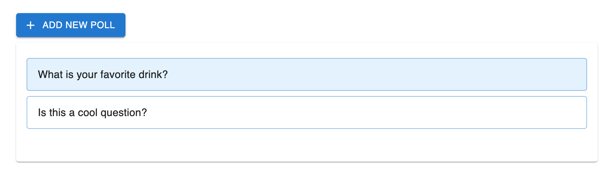
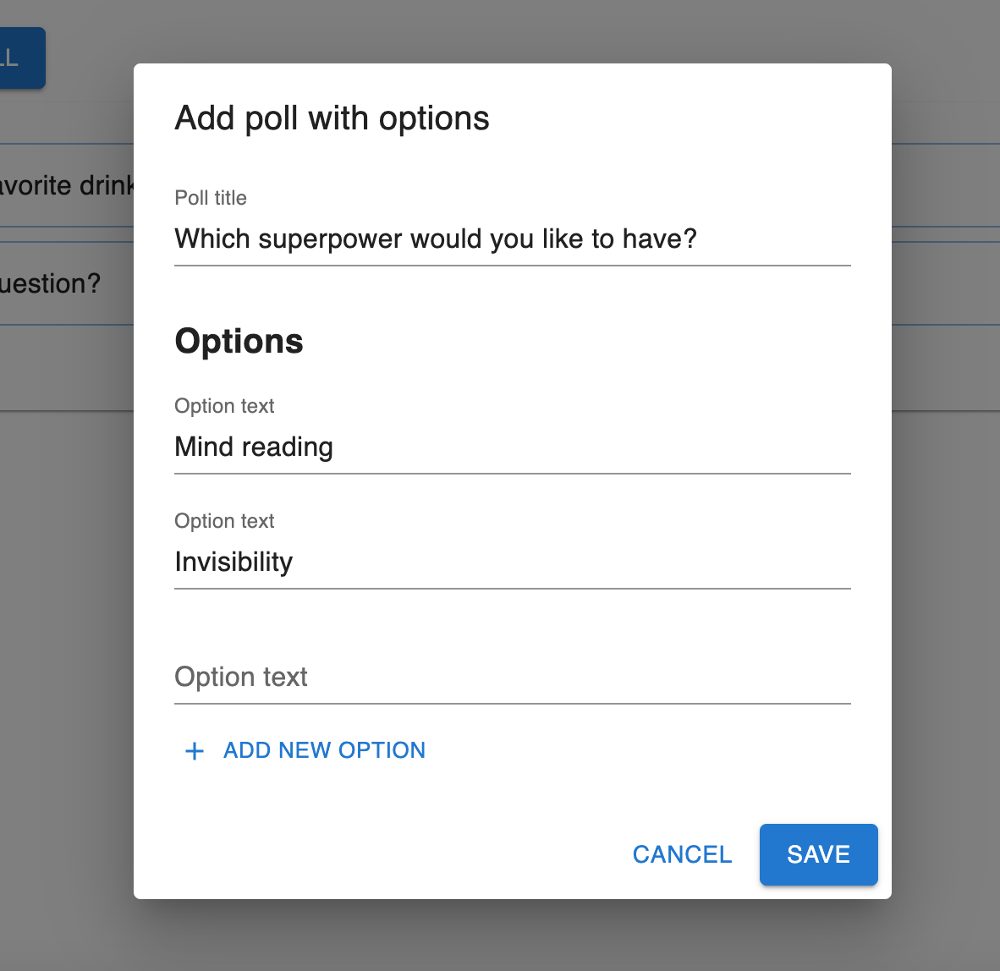
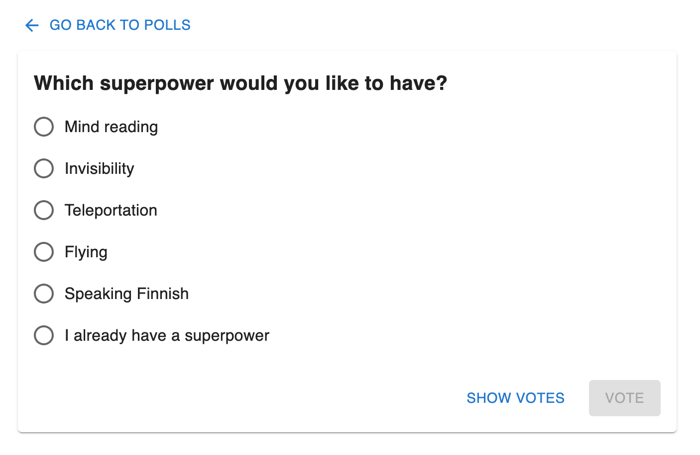
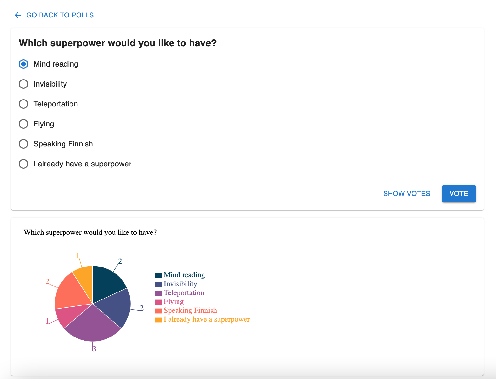

# ePoll application

ePoll is the latest invention to gather up opinions from friends and alike. It's quite like https://www.polly.ai/ but much more simple way.

## Requirements overview
- A poll is created by posting the question and its answer options to the backend.
- Polls can be listed and fetched individually.
- A vote can be cast to single option of an event, the backend will not record the identity of the voter and will just count individual votes per option.

## UI requirements

- List existing polls
- View poll options and their current vote counts
- Vote an option for a poll
- Create a new poll with title and options

## Screenchots

---

---

---

## Installation

If you want to run the web site

1. Download the code from the root folder

2. In the root folder run commands

- `npm install`

- `npm start`

3. Open [http://localhost](http://localhost) in a browser of your choise.

## Used languages and libraries:
- [TypeScript](https://www.typescriptlang.org/)
- [React](https://react.dev/)
- [Redux](https://redux.js.org/)
- [Material UI](https://mui.com/)
- [Recharts](https://recharts.org/)
